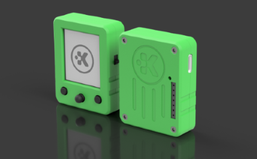

<!--
SPDX-FileCopyrightText: 2025 KOINSLOT, Inc.

SPDX-License-Identifier: GPL-3.0-or-later
-->

<h1 align='center'>
  Kywy
</h1>

<i>
  the tiny engine with big possibilities: education, game dev, diy electronics, and more
</i>

  
  &nbsp;
  
  &nbsp;
  
  &nbsp;
  

 

*Don't want the pitch? Click [here](./getting_started.md) to skip straight to the docs!*

# What is Kywy?

Kywy is hardware and software, artfully designed to blur the lines between the two.

The hardware features:

* a 144x168 LCD screen
* two buttons plus a joystick
* SD card slot
* all day battery life
* I/O: USB-C, GPIO headers, and I2C

The software is designed to give you easy and intuitive access to all of those with only a few lines of code.

## Kywy for Education

Kywy is designed to have as few steps as possible between you and what you want to see on the screen. With simple
interfaces and robust tutorials, Kywy has what you need to get started with embedded programming. You don't need to
worry about display protocols, SPI/I2C, input polling and debouncing, block devices, file systems, or any other
roablocks between you and making the Kywy hardware do what you want.

We're working with [Betabox Learning](https://betaboxlearning.com) to develop curricula for classrooms and for out-of-the-classroom learning so that
you can get started with embedded programming with one simple product.

## Kywy for Game Dev

Kywy has everything you need to create retro-style games that you can keep in your pocket. The engine boasts
multi-threading, event handling, sprites and sprite sheets, state machines, and much more in the pipeline. 

Check out our [examples](https://github.com/KOINSLOT-Inc/kywy/tree/main/examples/games) to see how you can re-create the
classics like Pong, Doodle Jump, Snake, and Flappy Bird!

## Kywy for DIY Electronics

Kywy is the perfect platform for DIY electronics projects. It removes all the barriers between you and what you want to
do.

Say you want to make a data collection device. With Kywy you get everything but the data collection for free. Just hook
up a sensor to the GPIO pins, write a simple program with the engine, and leverage our platform to give you:

* a screen to display the status
* buttons and functionality to create interative menus
* a battery/power management for performance without wires teathering you to the wall
* SD card integrations for data storage

Instead of having to develop an entire project breadboard, figure out displays & button interactions & storage
solutions, and package everything in a robust and portable form, you can just start and end with a Kywy device that can
get you from zero right to solving the problem you want to solve.

Don't get bogged down with 1000 little side issues; start with Kywy and get right to what you really want to do.

## Where to get a Kywy

Visit our [store](https://koinslot.myshopify.com) to get your Kywy today!

## Getting Started

Check out our [documentation](./getting_started.md) to kickstart your Kywy experience!

